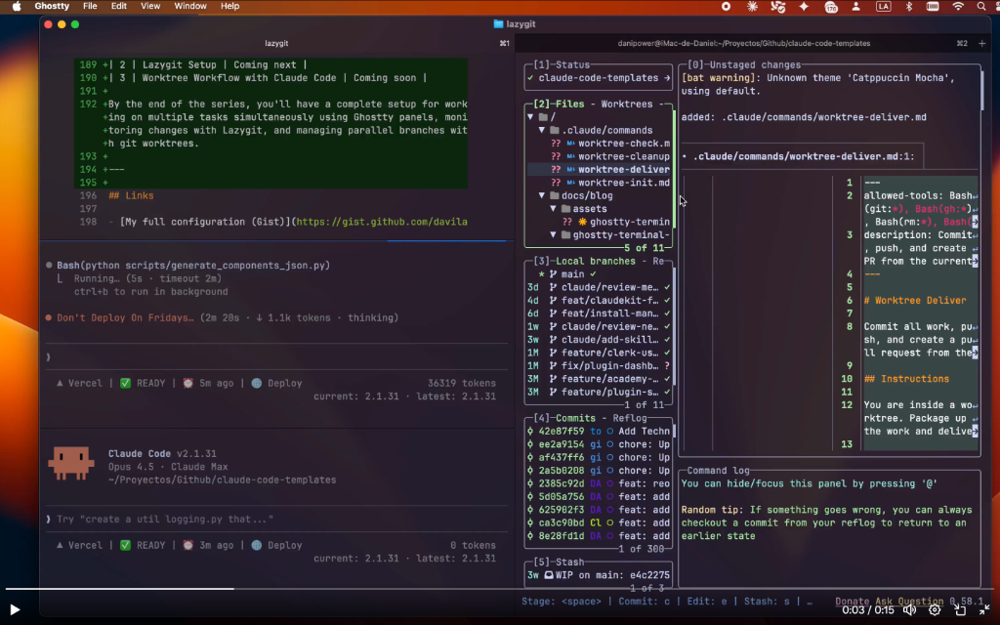

# 🚀 Claude Code + Lazygit + Worktrees: Power User Workflow

This guide explains how to set up the professional developer environment seen in your image, combining the power of **Claude Code** for AI-driven development with **Lazygit** and **Git Worktrees** for monitoring and parallelization.



---

## 1. Ghostty Setup

To achieve the "glassmorphism" look with transparency and blur, use the following configuration for Ghostty.

### Configuration (`~/Library/Application Support/com.mitchellh.ghostty/config`)

```bash
# --- Aesthetics & Glassmorphism ---
background-opacity = 0.85
background-blur-radius = 20
macos-titlebar-style = transparent
window-padding-x = 12
window-padding-y = 12

# --- Theme & Colors ---
theme = Catppuccin Mocha

# --- Typography ---
font-family = "JetBrainsMono Nerd Font"
font-size = 13

# --- Cursor & UX ---
cursor-style = block
cursor-style-blink = true
copy-on-select = true

# --- Window Management ---
macos-option-as-alt = true
confirm-close-surface = false

# --- Key Bindings ---
keybind = cmd+shift+r=reload_config
```

---

## 2. Monitoring Claude Code with Lazygit

When **Claude Code** (`claude`) is editing your files, you want a real-time TUI (Terminal User Interface) to see exactly what's happening.

### Setup
1. **Split your Ghostty Terminal**: 
   - Open your project.
   - Use `Cmd + D` (Vertical Split) to have two side-by-side panes.
2. **Launch tools**:
   - In the **Left Pane**, run: `lazygit`
   - In the **Right Pane**, run: `claude`

### Workflow
- As you give instructions to Claude (e.g., *"Refactor the auth service"*), Claude will start writing files.
- **Lazygit** will automatically detect these changes.
- Click or navigate to the **Files** panel in Lazygit to see the diffs in real-time.
- If Lazygit doesn't refresh instantly, hit `R` to force a refresh.

---

## 3. Parallel Agents with Git Worktrees

Git Worktrees allow you to have multiple branches of the same repository checked out in DIFFERENT directories. This is the ultimate way to run multiple Claude instances without context switching.

### Why use Worktrees with Claude?
- **No Stashing**: You don't need to `git stash` to switch branches.
- **Simultaneous Work**: Branch A can be fixing a bug while Branch B (in another folder) is implementing a new feature.
- **Agent Parallelization**: Run `claude` in Folder A and another `claude` in Folder B.

### Setup Guide

1. **Create a Worktree**:
   From your main project directory, run:
   ```bash
   git worktree add ../feature-branch existing-branch-or-new
   ```
   *This creates a new folder `../feature-branch` with that branch checked out.*

2. **Open the Parallel environment**:
   - In Ghostty, create a new tab or pane.
   - `cd ../feature-branch`
   - Run `claude` here.

3. **Monitor with Lazygit**:
   Lazygit is worktree-aware. When you are in a worktree, Lazygit shows you the status of that specific worktree. If you want to see all worktrees, you can navigate to the **Worktrees** panel (usually pane `2` in the Standard layout).

### Advanced Ghostty Tip: The "Triple Threat" Layout
To match your image exactly:
1. `Cmd + D` (Split Vertically)
2. `Cmd + Shift + D` (Split the Right Pane Horizontally)
3. **Pane 1 (Left)**: `lazygit` (Main project)
4. **Pane 2 (Top Right)**: `lazygit` or `cd ../worktree && lazygit`
5. **Pane 3 (Bottom Right)**: `claude`

> [!IMPORTANT]
> Ensure you have `lazygit` and `claude-code` installed via Homebrew:
> `brew install lazygit jpacca/tap/claude-code`
